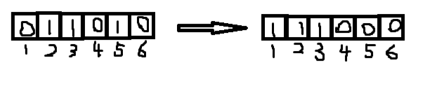

# 12118.聪明的交换策略【算法赛】

蓝桥杯题库 [题目链接](https://www.lanqiao.cn/problems/12118/learning/)。

> 主要考察思维

满足条件的情况有两种：00001111和11110000。由于不能事先知道0在左还是1在左使得交换次数最少，所以两种方式都需要求。



如上图所示，交换前1的下标分别为2，3，5。交换后为1，2，3。观察第一个1下标从2到1的过程中交换了2-1次。事实上求把所有的1移动到最左边，只需要求移动前的下标和减去移动后的下标和即可。

### C代码

### C++代码

### Java代码
时间复杂度：
```Java
import java.util.Scanner;

public class Main {
    public static void main(String[] args) {
        Scanner scan = new Scanner(System.in);
        int n = scan.nextInt();
        // 注意此处为了让字符串下标从1开始，所以在字符串随便拼接一个"t"
        String str = "t"+scan.next();
        long a = 0, b = 0;// a和b分别记录移动前的下标和与移动后的下标和
        long ans = Long.MAX_VALUE;
        // 计算1在左边的情况
        for (int i = 1; i <= n; i++) {
            if (str.charAt(i) == '1') {
                a+=i;
                b++;
            }
        }
        ans = Math.min(ans, a - (1 + b) * b / 2);

        // 计算0在左边的情况
        a = 0;
        b = 0;
        for (int i = 1; i <= n; i++) {
            if (str.charAt(i) == '0') {
                a+=i;
                b++;
            }
        }
        ans = Math.min(ans, a - (1 + b) * b / 2);
        System.out.println(ans);
        scan.close();
    }
}
```

### Python3代码