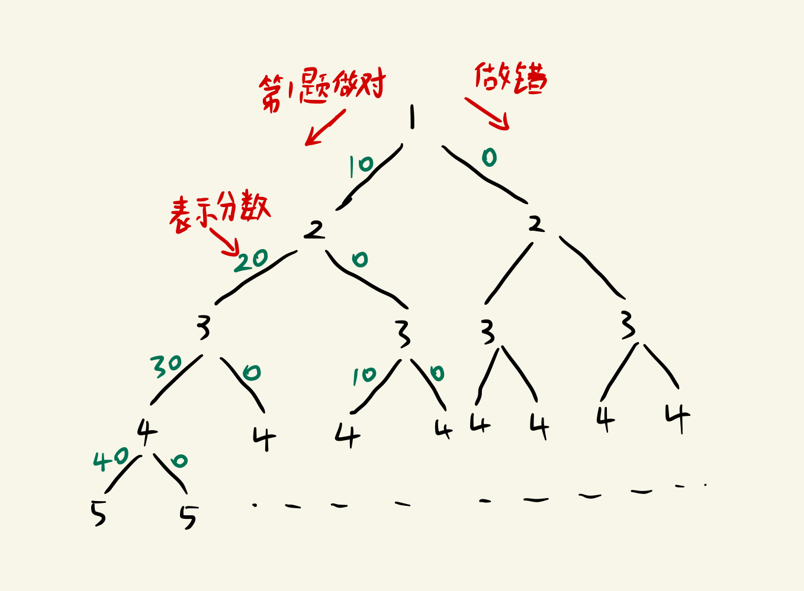

# 3497.有奖问答

蓝桥杯题库 [题目链接](https://www.lanqiao.cn/problems/3497/learning/)。

填空题，答案：8335366

> 暴力



使用递归来遍历树形结构的树， 当分数为100或做题数量大于30的时候结束(树的高度)

> 动态规划

### 解题思路

考虑使用动态规划解决问题，定义 $f_{i,j}$ 表示已经回答了 $i$ 道题，且当前得分为 $j$ 的方案数。

首先，对于状态的初始化有 $f_{0,0}=1$ ，因为一道题都未回答时分数恰好为 $0$，也是满足条件的。

接下来考虑状态转移方程，我们需要对 $j$ 的值进行分类讨论来进行转移：

- 若 $j=0$，说明小蓝答错了第 $i$ 道题，则在回答第 $i-1$ 道后可能的分数区间为 $[0,90]$（注意满 $100$ 分时游戏直接结束了），所以转移方程为：

$$
f_{i,j}=\ \sum_{k=0}^{90}f_{i-1,k}
$$

- 若 $j>0$，说明小蓝答对了第 $i$ 道题，此时一定能确定在回答完第 $i-1$ 道题时小蓝的分数为 $j-10$，所以转移方程为：
 $$
 f_{i,j}=f_{i-1,j-10}
 $$


注意观察题目条件，小蓝可以随时停止答题，所以小蓝可能还未答满三十题但已经获得 $70$ 分便停止回答。所以最终答案为计算：
$$
\sum_{i=1}^{30} f_{i,70}
$$

### C++代码

```c++
// 动态规划
#include<bits/stdc++.h>
using namespace std;
const int N = 200;

int f[N][N];
int main()
{
    f[0][0] = 1;
    for (int i = 1; i <= 30; ++i) {
        for (int j = 0; j <= 90; j += 10) {
            if (!j) {
                for (int k = 0; k <= 90; ++k) {
                    f[i][j] += f[i - 1][k];
                }
            } else {
                f[i][j] += f[i - 1][j - 10];
            }
        }
    }
    int ans = 0;
    for (int i = 1; i <= 30; ++i) ans += f[i][70];
    cout << ans << '\n';
    return 0;
}
```

### Java代码

```Java
// 暴力
public class Main {
	static int ans;
	public static void main(String[] args) {
		dfs(0, 0);
        System.out.println(ans);
    }

    static void dfs(int k, int sum){
        if (k > 30 || sum == 100) {
        	return ;
        }
        if (sum == 70) {
        	ans++;
        }
        dfs(k + 1, sum + 10);
        dfs(k + 1, 0);
    }
}
```

```java
// 动态规划
public class Main {
    public static void main(String[] args) {
        int[][] dp = new int[31][11];
        dp[1][0] = 1;
        dp[1][1] = 1;

        for(int i = 1; i <= 30; i++) {
            for(int j = 0; j <= 10; j++) {
                if(j == 0 && i != 1) {
                    for(int x = 0; x <= 9; x++) {
                        dp[i][j] += dp[i - 1][x];
                    }
                }
                if(j != 0 && i != 1) {
                    dp[i][j] = dp[i - 1][j - 1];
                }
            }
        }
        int ans = 0;
        for(int i = 0; i <= 30; i++)
            ans = ans + dp[i][7];
        System.out.println(ans);
    }
}
```

### Python3代码