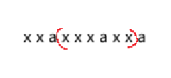
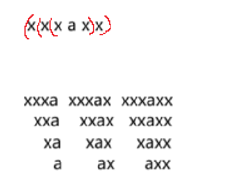

# 499.子串分值

蓝桥杯题库 [题目链接](https://www.lanqiao.cn/problems/499/learning/)。

> 暴力解法

这题很容易想到暴力解题的思路，但是只能通过一半的测试用例。暴力解法代码如下：

```Java
import java.util.Scanner;

public class Main {
    public static void main(String[] args) {
        Scanner scan = new Scanner(System.in);
        String str = scan.next();
        int len = str.length(), ans = 0;
        for (int i = 0; i < len; i++) {
            for (int j = i; j < len; j++) {
                String tmpStr = str.substring(i, j+1);
                ans = ans + f(tmpStr);
            }
        }
        System.out.println(ans);
        scan.close();
    }

    static int f(String str) {
        int len = str.length(), sum = 0;
        int[] s = new int[26];
        for (int i = 0; i < len; i++) {
            s[str.charAt(i) - 'a']++;
        }
        for (int i = 0; i < s.length; i++) {
            if (s[i] == 1) {
                sum++;
            }
        }
        return sum;
    }
}
```

> 贡献法

贡献法就是计算每个字符对最终结果能提供的贡献值，假设有字符串: xxaxxxaxxa。字符串中共有三个a，我们尝试计算一下第二个a对结果的贡献：

因为题目要求字符只出现一次的时候才会有贡献，那么第二个a在所有的子串情况下，有贡献的那一部分就要在第一个a后面，最后一个a前面的那一部分子串。如下图：



那么现在只需要考虑，在子串xxxaxx的子串中有多少种情况包含这个a，显而易见有如下12种：



我们可以得到其中的规律是：该字符的贡献度等于 (左边的距离+1) 乘 (右边的距离+1)。其中的距离指的是该字符到下一个相同字符的下标距离。具体代码如下：
### C++代码

### Java代码
```Java
import java.util.Scanner;

public class Main {
    public static void main(String[] args) {
        Scanner scan = new Scanner(System.in);
        char[] s = scan.next().toCharArray();
        int len = s.length, ans = 0;

        for (int i = 0; i < len; i++) {
            // 计算第i个字符的贡献度，l和r分别代表字符左右的边界距离
            int l = 0, r = 0;
            for (int j = i - 1; j >= 0 && s[j] != s[i]; j--) {
                l++;
            }
            for (int j = i + 1; j < len && s[j] != s[i]; j++) {
                r++;
            }
            ans = ans + (l+1) * (r+1);
        }
        System.out.println(ans);
        scan.close();
    }
}
```

### Python3代码