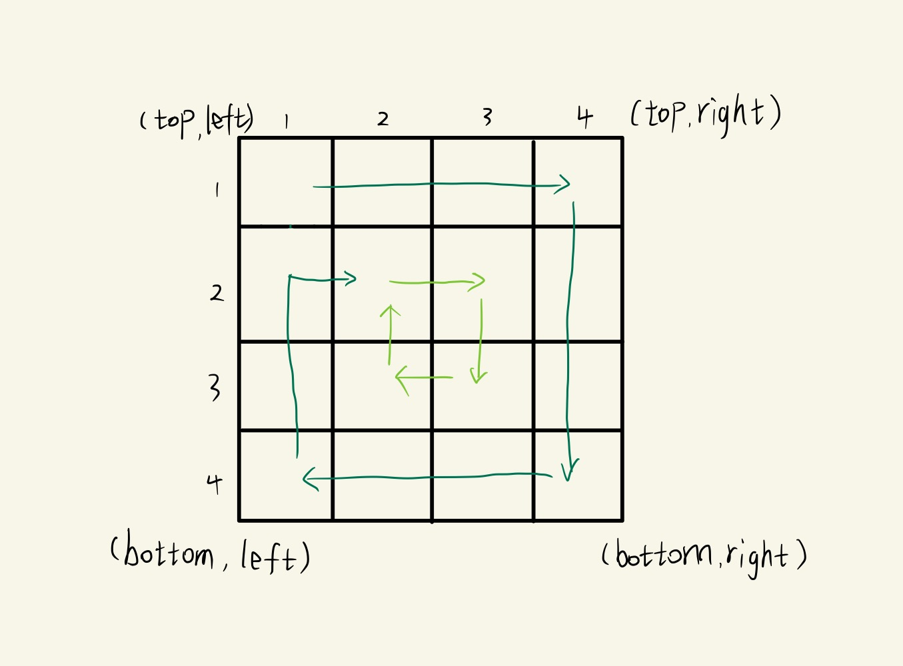

# 6413.小蓝的迷宫问题一

蓝桥杯题库 [题目链接](https://www.lanqiao.cn/problems/6413/learning/)。

> 模拟

题意，给出一个 n * n 的正方形迷宫，按照顺时针螺旋走位。当走到坐标(i, j)的时候走了多少步？

<!--  -->


> 按层模拟

可以将地图看成若干层，从外层向内层遍历。

对于每层，从左上方开始以顺时针的顺序遍历所有元素。假设当前层的左上角位于 (top,left)，右下角位于 (bottom,right)，按照如下顺序遍历当前层的元素。

1. 从左到右遍历上侧元素，依次为 ```(top,left)``` 到 ```(top,right)```。
2. 从上到下遍历右侧元素，依次为 ```(top+1,right)``` 到 ```(bottom,right)```。
3. 从右到左遍历下侧元素，依次为 ```(bottom,right−1)``` 到 ```(bottom,left+1)```。
4. 从下到上遍历左侧元素，依次为 ```(bottom,left)``` 到 ```(top+1,left)```。

遍历完当前层的元素之后，将 left 和 top 分别增加 1，将 right 和 bottom 分别减少 1，进入下一层继续遍历，直到遍历到目标坐标停止。

### C++代码

### Java代码
```Java
import java.util.Scanner;

public class Main {
    public static void main(String[] args) {
        Scanner scan = new Scanner(System.in);
        int n = scan.nextInt();
        int I = scan.nextInt();
        int J = scan.nextInt();
        long ans = 1;

        int left = 1, right = n, top = 1, bottom = n;
        while (true) {
            for (int col = left; col <= right; col++) {
                if (top == I && col == J) {
                    System.out.println(ans);
                    return;
                }
                ans++;
            }
            for (int row = top + 1; row <= bottom; row++) {
                if (row == I && right == J) {
                    System.out.println(ans);
                    return;
                }
                ans++;
            }
            for (int col = right - 1; col > left; col--) {
                if (bottom == I && col == J) {
                    System.out.println(ans);
                    return;
                }
                ans++;
            }
            for (int row = bottom; row > top; row--) {
                if (row == I && left == J) {
                    System.out.println(ans);
                    return;
                }
                ans++;
            }
            left++;
            right--;
            top++;
            bottom--;
        }
    }
}
```

### Python3代码
